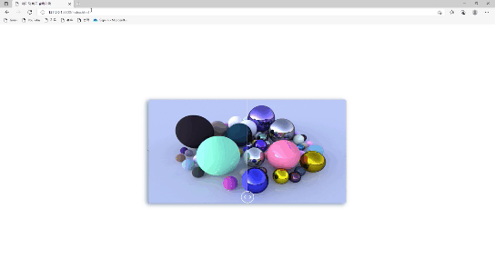

[](https://app.netlify.com/sites/image-comparison-vanilla-ohminkwon/deploys)

# image-comparison



👉 [DEMO](https://image-comparison-vanilla-ohminkwon.netlify.app/)

3D 아티스트 및 테크니컬 아티스트를 위한 셰이더 또는 텍스쳐 변경에 대한 결과물 차이를 비교하기 위한 포트폴리오 기능 만들기 예제 입니다.

## Font Awesome

[`Font Awesome`](https://fontawesome.com/) 에서 제공하는 머터리얼 아이콘을 무료로 사용할 수 있습니다.

```html
<link rel="stylesheet" href="https://cdnjs.cloudflare.com/ajax/libs/font-awesome/6.0.0-beta2/css/all.min.css">
```

다음과 같이 사용할 수 있습니다.

```html
<i class="fas fa-chevron-left"></i>
```

## tilt.js

[`vanilla-tilt.js`](https://micku7zu.github.io/vanilla-tilt.js/)에서 제공하는 기울기 애니메이션 효과 라이브러리 입니다. <br>
마우스 위치에 따라 기울기 효과를 줍니다.<br>


```js
VanillaTilt.init(document.querySelector("#image-comparison-slider"), {
  max: 5,
  speed: 800,
  scale: 1.02
})
```

이외에도 아래와 같이 다양한 옵션을 통해 각도, 방향, 속도, 크기, 축, 광택등을 추가하여 표현할 수 있습니다.

```js
{
  reverse:                false,  // reverse the tilt direction
  max:                    35,     // max tilt rotation (degrees)
  startX:                 0,      // the starting tilt on the X axis, in degrees.
  startY:                 0,      // the starting tilt on the Y axis, in degrees.
  perspective:            1000,   // Transform perspective, the lower the more extreme the tilt gets.
  scale:                  1,      // 2 = 200%, 1.5 = 150%, etc..
  speed:                  300,    // Speed of the enter/exit transition
  transition:             true,   // Set a transition on enter/exit.
  axis:                   null,   // What axis should be disabled. Can be X or Y.
  reset:                  true,    // If the tilt effect has to be reset on exit.
  easing:                 "cubic-bezier(.03,.98,.52,.99)",    // Easing on enter/exit.
  glare:                  false,   // if it should have a "glare" effect
  "max-glare":            1,      // the maximum "glare" opacity (1 = 100%, 0.5 = 50%)
  "glare-prerender":      false,  // false = VanillaTilt creates the glare elements for you, otherwise
                                  // you need to add .js-tilt-glare>.js-tilt-glare-inner by yourself
  "mouse-event-element":  null,    // css-selector or link to HTML-element what will be listen mouse events
                                  // you need to add .js-tilt-glare>.js-tilt-glare-inner by yourself
  gyroscope:              true,    // Boolean to enable/disable device orientation detection,
  gyroscopeMinAngleX:     -45,     // This is the bottom limit of the device angle on X axis, meaning that a device rotated at this angle would tilt the element as if the mouse was on the left border of the element;
  gyroscopeMaxAngleX:     45,      // This is the top limit of the device angle on X axis, meaning that a device rotated at this angle would tilt the element as if the mouse was on the right border of the element;
  gyroscopeMinAngleY:     -45,     // This is the bottom limit of the device angle on Y axis, meaning that a device rotated at this angle would tilt the element as if the mouse was on the top border of the element;
  gyroscopeMaxAngleY:     45,      // This is the top limit of the device angle on Y axis, meaning that a device rotated at this angle would tilt the element as if the mouse was on the bottom border of the element;
}
```
## Responsive Web

반응형 분기점을 설정하여 특정 해상도 변화에 따른 비율을 변경 합니다.

```css
@media (max-width: 768px) {
  :root{
    --image-comparison-slider-width: 90vw;
  }   
}
```


## Reference
- https://compressor.io/
- https://www.youtube.com/watch?v=bYh5X0fNYu0
- https://www.youtube.com/watch?v=2KMJxHW21cU